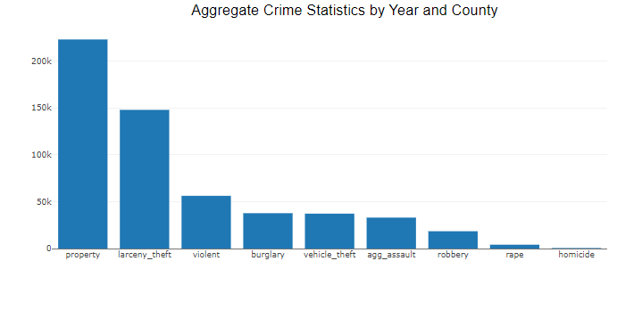

# Project 3
# Crime Rate in California from 2019 to 2022

## Team Members:
* Daniel Greener
* Denisse Ogata
* Maryam Najiarani
* Jayashree Kotte 
* Kelvin Ramos

## Background:
The crime rate in California over the past few years got us equally concerned and scared for our own safety and prompted us to delve deep into this topic for our project. It appears that crimes have escalated in the state, including burglary, aggravated assault, racial/hate crimes, vehicle thefts, property thefts, etc. These crimes have affected many known people and lead to well-known stores getting shut down. The patterns piqued our interest and incited an urge to uncover crime rate trends in the state of California. This paved way to creating a Crime Mapping Tool, thus providing a well-curated and unique interactive visual dashboard for utilization by California residents.

## Project Overview:
* Collected crime data from US DOJ and census data from Census Bureau websites with the intention of analyzing crime patterns in California pre-pandemic and post-pandemic for the years 2019 through 2022.
* Combined and cleaned the csv files and removed unwanted columns
* Further clean up of data was done using pandas, cleaned and formatted data (renamed column names, converted int to string data type for month column, dropped NAN values, dropped unwanted columns.)
* Finally converted the pandas data frame into an sqlite file to use as our backend database.
* Created a python file to connect flask to our web application (frontend) and add necessary endpoints for the dashboard and California map 
* To add structure and style to our web pages, we used HTML and CSS 
* To add functionality to our dashboard we used *app.js* and *index.html* to code the dropdowns, filtering and visulaizations.
* To add functionality to our California map we used *calimap.js* and *calimap.html* to code the dropdowns, filtering and visulaizations.
* Finally we used pandas for analysis and found trends by grouping the data into each year, creating 4 different dataframes, retrieved the five highest crime counts for each county and calculated the increase of all crimes and counties by each year consecutively.
* We intend this data to be consumed by all California residents for varied purposes including home rentals, homeowners, school safety in different counties etc,.

## Potential questions to be answered:
1. What is the most frequently occurring crime type in different counties?
2. How have different crime rates trended in recent years and does it have any relation with the pandemic?
3. Can a user search for different crimes in their county for a specific year.
4. How has the rate fluctuated for a specific crime through the years for different counties?
5. What is the geographic distribution of specific crimes in different counties?

## Project Analysis:
* Across the board, the highest occurred crime types in California is Property, Larceny theft and Vehicle theft.
* Highest crime rate in California are Property by 39.9%, Larceny theft by 27.8% and Vehicle theft by 10.4%
* During 2019-2022, property theft, the highest occurring crime had over 200k incidents in Los Angeles County alone and the other populous counties had 50-60k incidents.
* Based on the highest crime rates in the state of California. We analyzed three of the most populated counties and drew comparisons from the year 2019.

    * Highest crime counts in LA county in 2019:   
        
        
        | Crime Type | Crime Counts|
        | -------- | ------- |
        | Property | 222,907 |
        | Larceny Theft | 147,902 |
        | Vehicle Theft | 37,266 |
    
    * Highest crime counts in Alameda county in 2019:   
        
        
        | Crime Type | Crime Counts|
        | -------- | ------- |
        | Property | 66,349 |
        | Larceny Theft | 49,640 |
        | Vehicle Theft | 10,216 |

    * Highest crime counts in San Diego county in 2019:   
        
        
        | Crime Type | Crime Counts|
        | -------- | ------- |
        | Property | 55, 030 |
        | Larceny Theft | 37,698 |
        | Vehicle Theft | 9,666 |

* Taking these counties as reference. We compare the lowest crime rates from 2019 to 2022.

    * LA county - lowest crime rate between 2019, 2020 and 2022.

        | Year | Crime Type | Crime Count |
        | ---- | ---------- | ----------- |
        | 2019 | Homicide | 508 |
        | 2019 | Homicide | 677 |
        | 2019 | Homicide | 738 |

    * San Diego county - lowest crime rate between 2019, 2020 and 2022.

        | Year | Crime Type | Crime Count |
        | ---- | ---------- | ----------- |
        | 2019 | Homicide | 86 |
        | 2019 | Homicide | 112 |
        | 2019 | Homicide | 106 |

    * Alameda county - lowest crime rate between 2019, 2020 and 2022.

        | Year | Crime Type | Crime Count |
        | ---- | ---------- | ----------- |
        | 2019 | Homicide | 96 |
        | 2019 | Homicide | 143 |
        | 2019 | Homicide | 158 |

Note: These were a few trends in crime rates we've uncovered using our data and visualizations. 
    

## How to install and run the code

* Git clone the project link to the local repository 
* Ensure flask is already installed on the local machine using command *pip show flask*
* If Flask isn't installed, then install flask using command *pip install flask*
* To run the web application, you'll first tell Flask where to find the application using FLASK_APP environment variable: *export FLASK_APP = app (app should be replaced based on the name of the python file)* This command needs to be run in the same directory as the python file.
* Then run it in development mode with the FLASK_ENV environment variable: *export FLASK_ENV=development*
* Lastly, run the application using the command: *flask run*
* Once flask is running successfully, you will see a localhost IP address URL in your terminal/command prompt, click on that to view the web application come alive.
* Once the application is accessible, the user has 3 visualizations in the main dashboard and another California map visualization accessible through the nagigational link in the banner of the dashboard.
* They also have access to a dropdown of the years (2019 to 2022) and all counties of California 
* User can select any year (2019 to 2022) and county to see the bar and pie charts show the crime count and crime rate respectively, while the google chart shows the yearly crime count for the 5 most populous counties of California for the selected year.
* Additionally, user could access the California Map using the navigational link, select different crime type and year to see in which county, the crime type is most and least prevalent in.
* For the California map, the deepest red signifies that the highest crime rate of selected crime type and the lighter reds and white signify the county with the least crime rate for the selected crime type.
* User can also click on any county on the map and it'll show a pop-up with all the various crime types and their counts along with the county name for ease of use.

Note: We've strived to make it as user friendly as possible and hope that it'll be of use to anyone residing in California to check their county crime stats.

## Visualizations:

## Credits:
To complete this project, we used several resources, including our TAs help. We were able to find helpful explanations of several concepts including using Flask to connect our webpage and backend, creating a donut chart for the data, creating a google chart, the California map geojson etc. This was a very insightful and great learning experience. 

## References:
Data was collected from the following sources  
Crimes: https://openjustice.doj.ca.gov/data  
Data Elements and Values Defined : https://data-openjustice.doj.ca.gov/sites/default/files/dataset/2023-06/Crimes-Clear-Arson%20Context_06292023.pdf   
Population : https://www.census.gov/data/tables/time-series/demo/popest/2020s-counties-total.html 

https://codepen.io/anon/pen/zZNjBy

https://leafletjs.com/examples/geojson/

https://developers-dot-devsite-v2-prod.appspot.com/chart/interactive/docs/gallery/combochart

https://www.monterail.com/blog/javascript-libraries-data-visualization#eighteen

https://www.w3schools.com/js/

https://www.digitalocean.com/community/tutorials/how-to-make-a-web-application-using-flask-in-python-3

https://plotly.com/javascript/bar-charts/

https://codepen.io/Shokeen/pen/rzMZbW

https://www.youtube.com/watch?v=0nIkBLkBELA&ab_channel=BringYourOwnLaptop

https://www.tablesgenerator.com/markdown_tables

